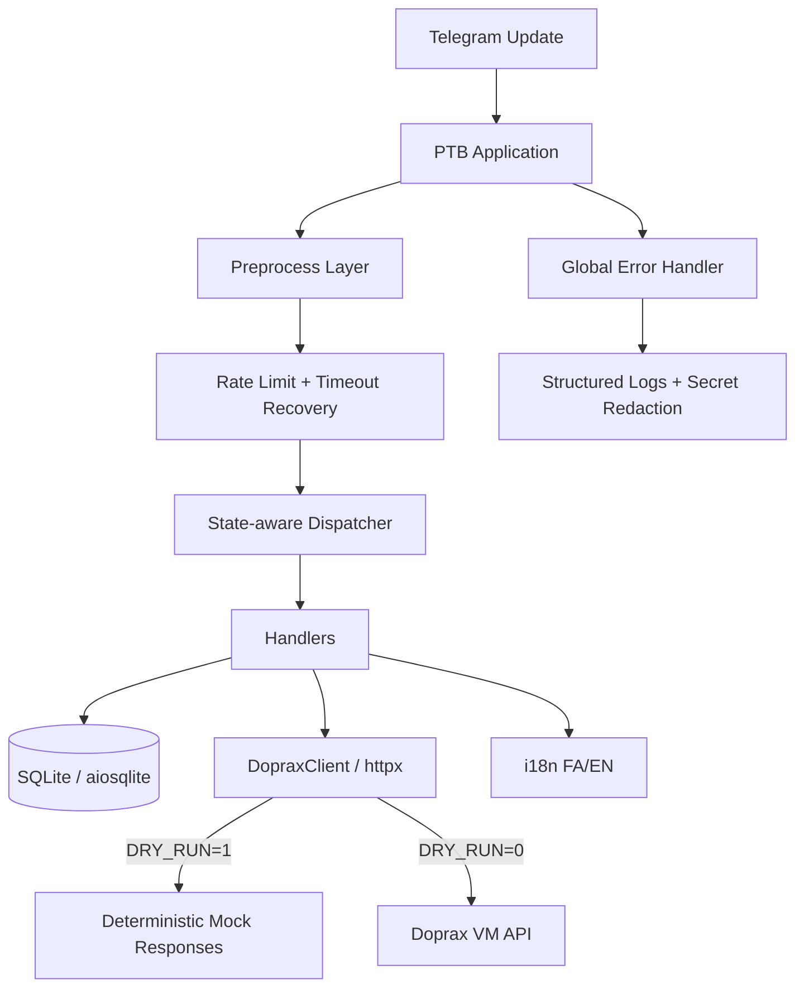

<h1 align="center">🚀 Doprax Telegram Bot</h1>

<p align="center">
  <strong>Production-grade Telegram bot for managing Doprax VMs</strong>
  <br />
  <span>Async • Bilingual FA/EN • SQLite FSM • Doprax API • Docker-ready</span>
</p>

<p align="center">
  <a href="https://github.com/power0matin/Doprax-Telegram-Bot/actions/workflows/ci.yml">
    
  </a>
  <a href="https://github.com/power0matin/Doprax-Telegram-Bot/blob/main/LICENSE">
    
  </a>
  
  
</p>

<p align="center">
  
  
  
  
  
  
</p>

<p align="center">
  <a href="#overview">Overview</a>
  ·
  <a href="#features">Features</a>
  ·
  <a href="#architecture">Architecture</a>
  ·
  <a href="#quick-start">Quick Start</a>
  ·
  <a href="#docker">Docker</a>
  ·
  <a href="#commands">Commands</a>
  ·
  <a href="#security">Security</a>
</p>


## Overview

**Doprax Telegram Bot** is a production-oriented Telegram bot for managing Doprax virtual machines through the Doprax VM API.

It is designed for a clean operational experience: users interact through Telegram menus, the bot keeps session state in SQLite, all network calls are async, and the codebase is protected by CI checks for linting, formatting, typing, testing, and package builds.

The bot supports both **فارسی** and **English**, making it suitable for bilingual operators, teams, and end users.


## Highlights

- ⚡ **Async-first architecture** with `python-telegram-bot` and `httpx`
- 🌐 **Bilingual UX** with runtime language switching: فارسی / English
- 🧭 **Menu-driven Telegram interface** with persistent reply keyboard and inline actions
- 🧠 **SQLite-backed FSM** for durable user sessions and creation workflows
- 🛡️ **Safe VM creation flow** with validation, Back/Cancel, timeout recovery, and create lock
- 🔁 **Deterministic DRY_RUN mode** for demos, tests, and local development
- 📦 **Docker-ready deployment**
- 🧪 **CI-protected quality gate** using Ruff, mypy, pytest, and package build
- 🔐 **Secret-safe logging** with redaction and correlation IDs
- 🩺 **Health command** for bot/API readiness checks


## Features

### Telegram UX

- `/start` onboarding with language selection
- Persistent reply keyboard for core actions
- Inline menus for VM management, settings, and wizard steps
- Status refresh button for VM status checks
- Localized user-facing messages
- Safe fallback for unknown input

### VM Management

- List virtual machines
- Check VM status by VM code
- Create VM through a guided step-by-step wizard
- Resolve location and machine codes from Doprax metadata
- Browse available locations, plans, and OS slugs

### Create VM Wizard

The VM creation wizard guides the user through:

1. Provider selection
2. Plan selection
3. Preferred location
4. VM name validation
5. OS slug selection
6. Final confirmation
7. VM creation request

Supported safeguards:

- Back navigation
- Cancel/reset
- Session timeout recovery
- Input validation
- Duplicate-create prevention
- User-friendly resolution suggestions

### Reliability

- Async API client with retry/backoff behavior
- Centralized error handling
- Localized recovery messages
- SQLite persistence for state, preferences, drafts, locks, and rate limits
- DRY_RUN mode for predictable test data


## Architecture




## Module Layout

```text
src/bot/
├── __init__.py
├── config.py          # Environment-based configuration
├── doprax_client.py   # Async Doprax API client and dry-run mocks
├── errors.py          # Controlled exception hierarchy
├── i18n.py            # FA/EN message catalog
├── keyboards.py       # Reply and inline Telegram keyboards
├── main.py            # Application wiring, routing, lifecycle, CI-safe entrypoint
├── states.py          # FSM states and transition helpers
├── storage.py         # Async SQLite persistence layer
├── utils.py           # Validation, logging, redaction, helper utilities
└── handlers/
    ├── common.py
    ├── create_vm.py
    ├── health.py
    ├── help.py
    ├── list_vms.py
    ├── locations.py
    ├── menu.py
    ├── os_list.py
    ├── settings.py
    ├── start.py
    ├── status.py
    └── vm_mgmt.py
```

```text
tests/
├── test_doprax_client.py
├── test_i18n.py
├── test_states.py
└── test_validation.py
```


## Requirements

- Python **3.11+**
- Telegram bot token from BotFather
- Doprax API key unless using `DRY_RUN=1`
- SQLite-compatible filesystem
- Optional: Docker / Docker Compose


## Environment Variables

Create a `.env` file from `.env.example`:

```bash
cp .env.example .env
```

| Variable | Required | Default | Description |
| --- | --- | --- | --- |
| `TELEGRAM_BOT_TOKEN` | Yes | — | Telegram bot token from BotFather |
| `DOPRAX_API_KEY` | Yes, unless `DRY_RUN=1` | — | Doprax API key |
| `DOPRAX_BASE_URL` | No | `https://www.doprax.com` | Doprax API base URL |
| `LOG_LEVEL` | No | `INFO` | Python logging level |
| `DB_PATH` | No | `./data/bot.db` | SQLite database path |
| `DRY_RUN` | No | `0` | Set to `1` for safe mock mode |

Example:

```env
TELEGRAM_BOT_TOKEN=123456:telegram-token
DOPRAX_API_KEY=your-doprax-api-key
DOPRAX_BASE_URL=https://www.doprax.com
LOG_LEVEL=INFO
DB_PATH=./data/bot.db
DRY_RUN=0
```

For local demo/testing without Doprax API calls:

```env
DRY_RUN=1
```


## Quick Start

### Linux / macOS

```bash
git clone https://github.com/power0matin/Doprax-Telegram-Bot.git
cd Doprax-Telegram-Bot

python -m venv .venv
. .venv/bin/activate

python -m pip install -U pip
python -m pip install -e ".[dev]"

cp .env.example .env
# edit .env

python -m bot.main
```

### Windows PowerShell

```powershell
git clone https://github.com/power0matin/Doprax-Telegram-Bot.git
cd Doprax-Telegram-Bot

py -3.11 -m venv .venv
.\.venv\Scripts\Activate.ps1

python -m pip install -U pip
python -m pip install -e ".[dev]"

Copy-Item .env.example .env
# edit .env

python -m bot.main
```

If PowerShell blocks activation:

```powershell
Set-ExecutionPolicy -Scope Process -ExecutionPolicy Bypass
.\.venv\Scripts\Activate.ps1
```


## Makefile

If you prefer `make`:

```bash
make install
make lint
make typecheck
make test
make run
```


## Docker

```bash
cp .env.example .env
# edit .env

docker compose up --build
```

Run in detached mode:

```bash
docker compose up --build -d
```

View logs:

```bash
docker compose logs -f
```

Stop:

```bash
docker compose down
```


## Commands

| Command | Description |
| --- | --- |
| `/start` | Start the bot and choose language |
| `/help` | Show help and quick guidance |
| `/lang` | Change language |
| `/menu` | Show the main menu |
| `/list_vms` | List VMs |
| `/create_vm` | Start the VM creation wizard |
| `/status <vm_code>` | Check VM status |
| `/locations` | Show locations and plan mappings |
| `/os` | Show available OS slugs |
| `/cancel` | Cancel the active workflow |
| `/health` | Check bot and Doprax connectivity |


## Menu Map

### Persistent Reply Keyboard

```text
📌 VM Management     ➕ Create VM
📋 List VMs          🔎 VM Status
🌍 Locations & Plans 💿 OS List
⚙️ Settings          ❓ Help
```

### Inline VM Management

- List VMs
- Status by VM code
- Refresh

### Create VM Wizard

```text
Provider
  ↓
Plan
  ↓
Preferred Location
  ↓
VM Name
  ↓
OS Slug
  ↓
Confirm
  ↓
Create
```

Available actions:

- Back
- Cancel
- Edit
- Create

### Settings

- Change language
- Toggle verbose mode
- About


## Development Workflow

Install development dependencies:

```bash
python -m pip install -e ".[dev]"
```

Run the same checks used by CI:

```bash
python -m ruff check .
python -m ruff format --check .
python -m mypy src tests --show-error-codes --pretty
python -m pytest -q -vv --maxfail=1 --disable-warnings
python -m build
```

Auto-fix style/lint issues:

```bash
python -m ruff check . --fix
python -m ruff format .
```


## Quality Gate

The CI workflow validates:

1. **Linting** with Ruff
2. **Formatting** with Ruff format
3. **Static typing** with mypy
4. **Unit tests** with pytest
5. **Package build** with `python -m build`
6. **Build artifacts** uploaded from `dist/`

Current quality targets:

- Python target: `3.11`
- Typed source and tests
- Strict-ish mypy configuration
- Ruff rules for pyupgrade, bugbear, simplification, comprehensions, import order, and Ruff-native checks


## Testing

Run all tests:

```bash
python -m pytest -q -vv --maxfail=1 --disable-warnings
```

Run a specific test module:

```bash
python -m pytest tests/test_doprax_client.py -q -vv
```

Run tests with dry-run behavior:

```bash
DRY_RUN=1 python -m pytest
```

On Windows PowerShell:

```powershell
$env:DRY_RUN = "1"
python -m pytest
```


## DRY_RUN Mode

`DRY_RUN=1` allows safe local operation without real Doprax API calls.

Useful for:

- Local development
- CI tests
- Demo environments
- UI/UX testing
- Handler validation

In dry-run mode:

- Doprax API calls are mocked
- VM list/status responses are deterministic
- VM creation returns a mock provisioning response
- `DOPRAX_API_KEY` is not required


## Logging

The bot emits structured JSON-style logs to stdout.

Logging includes:

- Startup events
- Correlation IDs for user-facing errors
- Redacted secrets
- Safe operational context

Known secret values are redacted from logs:

- `TELEGRAM_BOT_TOKEN`
- `DOPRAX_API_KEY`


## Security

- Never commit `.env`
- Use `.env.example` for safe configuration examples
- Keep Doprax API keys restricted and rotated
- Run production deployments under a dedicated OS user
- Protect SQLite DB file permissions
- Do not expose logs publicly
- Prefer Docker secrets or server-side environment variables in production

See [`SECURITY.md`](SECURITY.md) for additional security guidance.


## Troubleshooting

### Bot does not respond

Check:

```bash
python -m bot.main
```

Then verify:

- `TELEGRAM_BOT_TOKEN` is correct
- The bot is not already running somewhere else
- Logs do not show startup/config errors
- Network access to Telegram is available

### Dependency installation fails

Upgrade pip and reinstall:

```bash
python -m pip install -U pip
python -m pip install -e ".[dev]"
```

### `pyproject.toml` parse error

Validate that the file has no conflict markers:

```text
<<<<<<<
=======
>>>>>>>
```

Also ensure there are no accidental pasted URLs in TOML sections.

### Ruff fails

Auto-fix where possible:

```bash
python -m ruff check . --fix
python -m ruff format .
python -m ruff check .
```

### mypy fails

Run with full context:

```bash
python -m mypy src tests --show-error-codes --pretty
```

### Tests fail

Run the first failing test only:

```bash
python -m pytest -q -vv --maxfail=1 --disable-warnings
```

### Database errors

Check:

- `DB_PATH` parent directory exists
- The process has write permission
- Docker volume is mounted correctly
- SQLite files are not locked by another process

### Doprax API errors

Check:

- `DOPRAX_API_KEY`
- `DOPRAX_BASE_URL`
- `/health` output
- Network connectivity
- Doprax API availability


## Roadmap

Potential improvements:

- Webhook deployment mode
- Admin-only commands
- VM delete/restart actions
- Pagination for large VM lists
- More granular permission model
- Metrics endpoint
- Structured JSON logger adapter
- Optional PostgreSQL storage backend
- Integration tests against a staging Doprax API


## Contributing

Contributions are welcome.

Recommended flow:

1. Fork the repository
2. Create a feature branch
3. Run local checks
4. Open a pull request

```bash
python -m ruff check .
python -m ruff format --check .
python -m mypy src tests --show-error-codes --pretty
python -m pytest -q -vv --maxfail=1 --disable-warnings
```

For larger changes, please open an issue first to discuss the design.


## Maintainer

Maintained by **Matin Shahabadi**.

- Website: [`matinshahabadi.ir`](https://matinshahabadi.ir)
- Email: [`me@matinshahabadi.ir`](mailto:me@matinshahabadi.ir)
- GitHub: [`@power0matin`](https://github.com/power0matin)


## License

This project is licensed under the **MIT License**.

See [`LICENSE`](LICENSE) for details.
